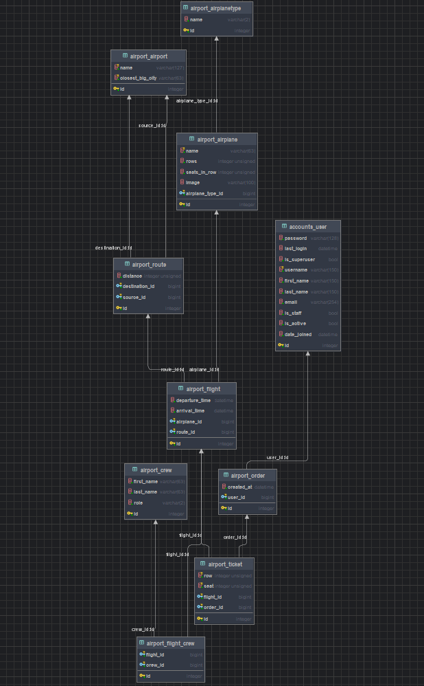

# AIRPORT API 

API service for airport management written on DRF

## Features
- JWT authenticated
- Admin panel `/admin/`
- Documentation is located at `/api/doc/swagger/`
- Managing order and tickets
- Creating new airplanes with different types
- Creating new routes and crews
- Creating new airports
- Adding new flights a
- Filtering airports, flights, routes, crews, airplanes, tickets and orders
- Populating a database with one command
- Custom permissions for users

## How to run the project

1. Clone the repository: 
```
git clone https://github.com/YaroslavBordovoy/drf-api-airport.git
```
2. Install env and dependencies::
```
python -m venv venv
venv\Scripts\activate (on Windows)
source venv/bin/activate (on macOS)
pip install -r requirements.txt
```
3. Install migrations:
```
python manage.py migrate
```
4. Start the server:
```
python manage.py runserver
```
5. To quickly fill the database, run the command:
```
python manage.py fill_db
```

### Important!
You must set up environment variables
```
# DJANGO SETTINGS
SECRET_KEY=<django-secret-key>
DJANGO_SETTINGS_MODULE=<core/manage.py>
DJANGO_ENV=<docker or local>

# DB SQLITE
DB_NAME=<local-db>

# DB POSTGRES
POSTGRES_DB=<db_name>
POSTGRES_DB_PORT=<db_port>
POSTGRES_USER=<db_user>
POSTGRES_PASSWORD=<db_password>
POSTGRES_HOST=<db_host>
PGDATA=<pgdata>

# CSV files
DATA_CITIES_LITE_PATH=<Path to csv file with list of cities (top 200 cities)>
DATA_CITIES_PATH=<Path to csv file with list of cities>
```

## RUN with docker
Docker should be installed
1. Pull the image: 
```
docker pull yaroslavbor/drf-api-airport-airport:latest
```
2. Enter the command:
```
docker run
```

## Getting access
- create user via `api/user/register/`
- get access via `api/user/token/`

## Database schema

